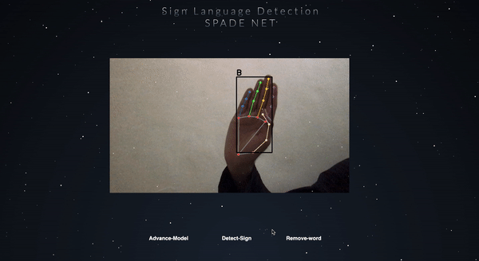
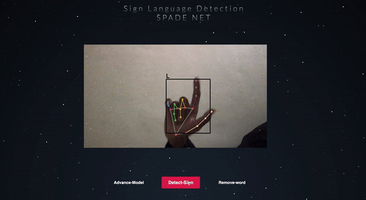
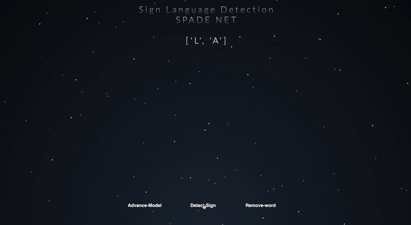
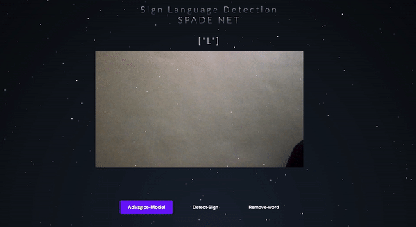

# Sign-Language-Detection-WebApp
This webApp can detect American sign language can capture and delete word with one press
*SLD will have two modes*
1.SLD-Simp-Mode
2.Adavance-Model-Mode
Currently 1 mode is operational which use mediapipe and rf trained model to detect sign
*Mode-1*

*Capture and Delete*

  | :| 
 
 *Advance mode* //on it  
 
 

